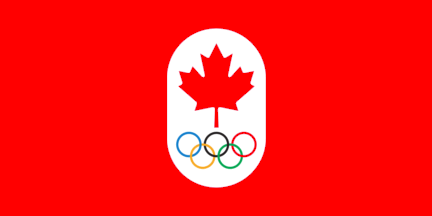

# DataViz - Olympic Data Outline

This Website is to deliver information about the medals won by Canada in Olympic Games in form of Graph.
To make it easy for the user to understand the data graphs are used.

###Getting started
This is a basic HTML/CSS build.

Clone this to the Location of your choice, and open it in a browser.

### Prerequisites
Adobe Photoshop, Google Drive and Git.

###Author
Anmol Singh Dhaliwal

##Liscense
This project is a copyright content.